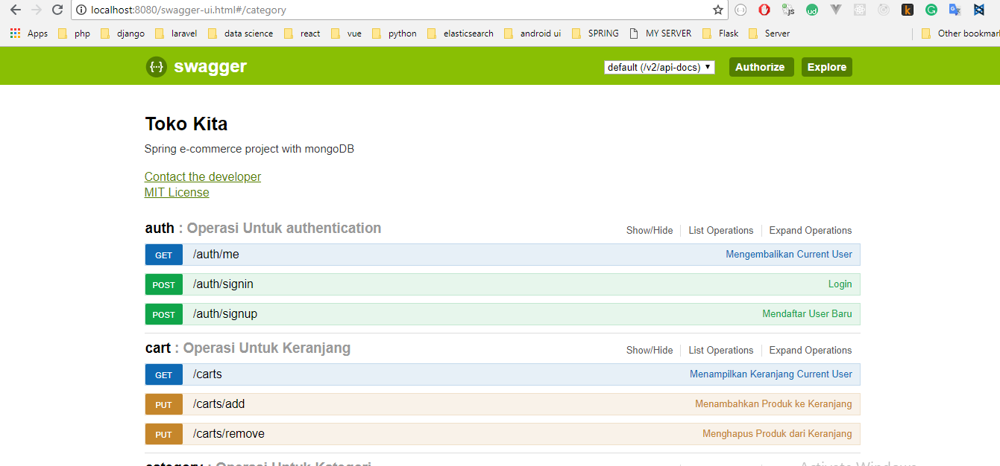
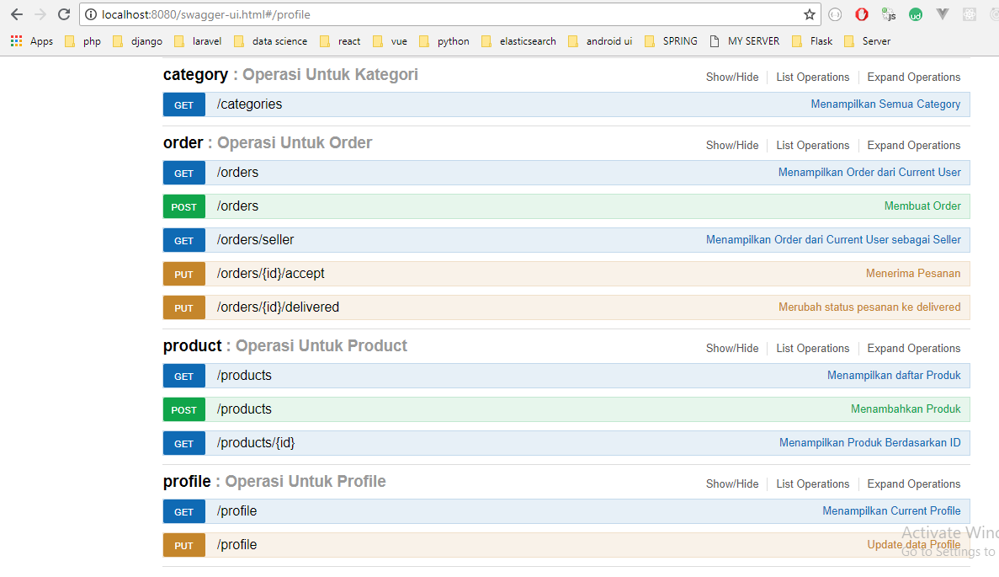
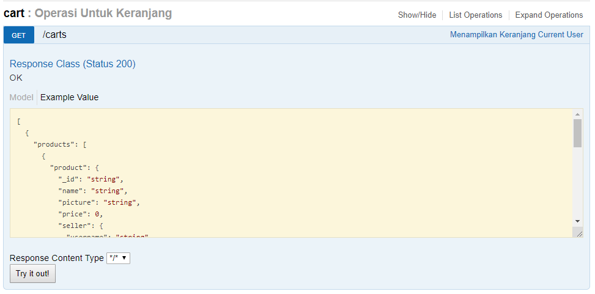

# spring-marketplace-webservice
Springboot Marketplace Web service with MongoDB

Documentaton available via SWAGGER

**display request data**  

**tech**  
Springboot with MongoDB + JWT

**How to use**  
1. setting DB in the application.yml in resource
2. Run Main Application
